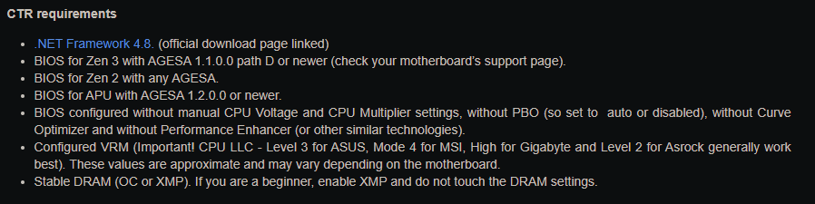
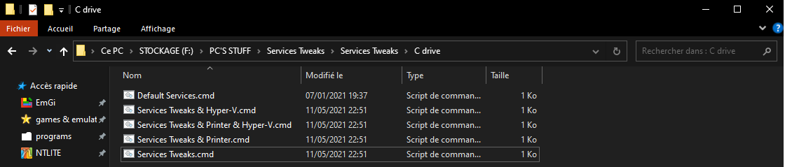

# Optimiser son PC et Windows 10 sans risque 

Dans ce github, j'ai compilé plusieurs tutos, guides de différentes personnes. Les trouvailles, tutos appartiennent aux personnes qui ont passés du temps à faire toutes ces recherches.
 
 [`CAPETLEVRAI`](https://www.twitter.com/capetlevrai) + [`GUIDE`](https://docs.google.com/document/d/1bfRI8ykV2esBQwy6x_3DX7WR_XLO-Y0bJ-0ds2Mbhek/edit) + [`YOUTUBE`](https://www.youtube.com/user/capetlevrai)

 [`PIWI`](https://www.twitter.com/piwielle) + [`GUIDE`](https://piwielle.github.io/oui) + [`YOUTUBE`](https://www.youtube.com/c/Piwi_youtube/)

 [`TOPACHAT`](https://www.twitter.com/topachat) + [`YOUTUBE`](https://www.youtube.com/user/topachat) 

A noter qu'il y a probablement du copier/coller venant des sources, c'est normal car c'est si bien expliqué que j'ai préféré laisser tel quel.

# DISCLAIMER

Avant de commencer ce guide, je tiens à faire quelques “disclaimer” sur ce qui sera expliqué dans ce manuel d’optimisation : 

- Tous les fichiers nécessaires, pour le suivi de ce guide, seront disponibles directement via ce dernier au fur et à mesure des chapitres. 

- Je ne serai en aucun cas responsable de tout dommage, défaut ou mauvaise manipulation de votre part. Ce guide est rédigé par mes soins après plusieurs tests de ce que j’en ai tiré dans mes recherches et les tutos que j’ai suivis. 

- Si vous êtes sur PC portable, vous pouvez suivre ce guide sans problème, cependant, je ne recommande pas de faire le point "[**Mode MSI**](#mode-msi)" qui pourrait poser problèmes sur votre machine. Si vous testez, c'est à vos risques.

- **Toutes les étapes overclockings sont facultatives ! Vous pouvez les passer si vous ne voulez pas faire n'importe quoi car vous n'êtes pas sereins !**

**JE NE FOURNIRAI PAS DE SUPPORT TECHNIQUE, VOUS ÊTES SEUL MAÎTRE DE VOS RESPONSABILITÉS ! LISEZ ATTENTIVEMENT LE GUIDE PAR CHAPITRE ET PRENEZ VOTRE TEMPS !** 

**NB :** cette icône "" signifie qu'il y a un lien sur lequel vous pouvez cliquer afin d'être redirigé vers une page source, de téléchargement ou un menu déroulant.

# Table des matières

- [**Optimisation du BIOS**](#optimisation-du-bios)
   - [**Mise à jour du BIOS**](#mise-à-jour-du-bios)
   - [**CPU AMD RYZEN**](#cpu-amd-ryzen)
      - [**ClockTuner For Ryzen**](#clocktuner-for-ryzen-recommandé-si-vous-voulez-overclock)
   - [**CPU INTEL**](#cpu-intel)
   - [**(OPTIONNEL) Overclocking**](#optionnel-overclocking)
   - [**Dépannage BIOS**](#dépannage-bios)
- [**Installation de Windows**](#installation-de-windows)
- [**Installation de vos drivers**](#installation-de-vos-drivers)
- [**Réglage du panneau de configuration Nvidia**](#réglage-du-panneau-de-configuration-nvidia)
   - [**Activer G-SYNC de la bonne manière**](#activer-g-sync-de-la-bonne-manière)
   - [**MSI Afterburner**](#msi-afterburner)
   - [**Désinstaller son pilote graphique proprement avec DDU**](#désinstaller-son-pilote-graphique-proprement-avec-ddu)
- [**Désactivation des drivers automatiques**](#désactivation-des-drivers-automatiques)
- [**Tweaks Regedit (les basiques)**](#tweaks-regedit-les-basiques)
- [**Mises à jour de Windows**](#mises-à-jour-de-windows)
- [**Paramètres de Windows**](#paramètres-de-windows)
   - [**Animations de Windows**](#animations-de-windows)
   - [**W10Privacy**](#w10privacy)
      - [**Windows Defender**](#windows-defender-mis-en-rouge-dans-w10privacy)
- [**Mode MSI**](#mode-msi)
- [**Mode de gestion d’alimentation**](#mode-de-gestion-dalimentation)
- [**Installer le Visual C++ Package et DirectX**](#installer-le-visual-c-package-et-directx)
- [**Réduire encore plus la latence**](#réduire-encore-plus-la-latence)
- [**Réactiver les mises à jour automatiques des drivers**](#réactiver-les-mises-à-jour-automatiques-des-drivers)
- [**Désactivation de certains services (facultatif)**](#désactivation-de-certains-services-facultatif)
- [**Désactiver les overlays et accélération matérielle**](#désactiver-les-overlays-et-accélération-matérielle)
- [**(BONUS) Liste des logiciels utiles à installer sur votre PC**](#bonus-liste-des-logiciels-utiles-à-installer-sur-votre-pc)

# Optimisation du BIOS

Avant d’entamer l’optimisation de Windows, il est préférable que vous ayez un bios bien réglé afin de pouvoir profiter du plein potentiel de votre ordinateur. 
Ces optimisations sont utiles, nous ne rentrerons pas dans les détails pour l’overclocking, il existe beaucoup de site qui peuvent vous y guider de manière très explicite et complète. Je vous laisse faire vos recherches à ce sujet. 
Ci-dessous, je mets les guides vidéos des cartes mères pour AMD et Intel en brutes avec toutes les explications pour effectuer les réglages. S’il vous manque une option qui n’est pas disponible dans votre bios, passez à la suivante, faites le plus de réglage que vous pouvez en suivant le guide. 

## Mise à jour du BIOS

N'hésitez pas à mettre votre BIOS à jour régulièrement ! Des corrections de bugs y sont souvent apportés et cela permet de gagner en stabilité et performence sur votre PC. 

Vous trouverez le fichier de mise à jour de votre modèle PRECIS de carte mère sur le site de votre constructeur (Asus, Gigabyte, MSI etc.). Voici un tuto si vous avez besoin d'avoir les étapes pour vous rassurer : 

 [`[DÉPANNAGE] Mettre ton BIOS à jour - TopAchat`](https://www.youtube.com/watch?v=HB8my058LQ0) 

**NB :** N'oubliez pas que vous pouvez sauver votre configuration de BIOS en sauvegardant un profil afin de pouvoir le récupérer par après. En effet, une fois le BIOS mis à jour, il est remis à 0, donc par défaut, comme sorti d'usine. Sauver un profil permet de gagner simplement du temps. 

Vous avez l'explication de comment sauver un profil dans le tuto optimisation de BIOS Intel mais cela est pareil pour AMD.

## CPU AMD RYZEN

**Note :** Dans l'idéal, laissez le SMT en "Auto", quelques personnes ont eu des soucis de stabilité en ayant désactiver le SMT (HyperThreading pour AMD).

  
 Soucis SMT (tiré du guide de Capet qui a eu ce retour par sa communauté)
 
  

Je recommande, pour ma part :  
- Laisser par défaut la plus part des options ;
- Activer le C-STATE (ne pas laisser sur "Auto" mais le passer en "Enable") ;
- Activer le PBO (Precision Boost Overdrive) ;
- Vous pouvez combiner le PBO ainsi qu'un OC avec CTR et activer la fonction "Hybrid OC" dans CTR. Tout est dans le tuto plus bas. 

## ClockTuner For Ryzen (recommandé si vous voulez overclock)

Pour la majorité d'entre vous, le PBO vous conviendra parfaitement, pas besoin de faire quelconque manipulation, tout est géré automatiquement par votre carte mère.

Si vous avez un CPU AMD Ryzen à partir de la génération Ryzen 3000, vous pouvez utiliser ce logiciel qui vous permettra d'OC automatiquement votre processeur via Windows directement.

  
 CTR - CONFIGURATION
 

  
 CTR 2.1 - CONFIGURATION
 

Le développeur de CTR insiste sur le fait que nous devons avoir une fréquence RAM stable, donc, on va activer le DOCP :

 
 ACTIVER LE DOCP

 

=> **NE TOUCHEZ A RIEN D'AUTRE !** Tout se fait automatiquement une fois le mode DOCP actif.

 [`ClockTuner For Ryzen`](https://www.guru3d.com/articles-pages/clocktuner-2-1-for-ryzen-(ctr)-guide,1.html)

Suivez et LISEZ BIEN le guide, afin de préparer votre BIOS comme il se doit. 

## CPU INTEL

**Note :** Laissez également l'HyperThreading sur les CPU Intel. En effet, la majorité des jeux vont bien gérer l'HT et, pour certains jeux, cela fait gagner des performences. Donc laissez activé.

 [`OPTIMISER SON BIOS INTEL - CAPET`](https://www.youtube.com/watch?v=xSjLnO5VZEY)

## (OPTIONNEL) Overclocking

 [`OVERCLOCKING CPU/RAM - CAPET`](https://www.youtube.com/playlist?list=PL96Ozk0v-00PNjvTPTvpMlT0sMGZvAXLg)

-> Ces étapes sont OPTIONNELLES. Vous n'êtes pas obligé de faire cette partie si vous n'êtes pas serein. Je la mets pour les plus téméraires.

Pour les CPU AMD Ryzen 3000 +, référez vous plutôt à cette étape : [**ClockTuner For Ryzen**](#clocktuner-for-ryzen-recommandé-si-vous-voulez-overclock)

## Dépannage BIOS

En cas de tout soucis (BIOS qui ne démarre pas notamment) pas de panique, faites un clear CMOS afin de remettre tout par défaut et repartir sur de bonnes bases :

 [`Faire un clear CMOS - TopAchat`](https://www.youtube.com/watch?v=Fc0HIDKC1U0)

# Installation de Windows

**Note :** Je préconise de partir sur un formatage complet de votre PC afin que tout ce guide se passe sans problème.

Pour ce faire, je vous redirige vers ce tuto très simple de TopAchat afin de pouvoir préparer votre clé USB bootable, installer Windows. 

 [`[TUTO] Installer Windows 10 & Tes Drivers - TopAchat [FR]`](https://www.youtube.com/watch?v=uHOP4UbEGug)

# Installation de vos drivers

Je vous **DÉCONSEILLE** fortement d'utiliser les softs style "DriverCloud" ou "DriverBooster" qui peuvent créer des conflits, installer des versions datées des drivers. Même s'il est rarement arrivé que des problèmes se montrent. 

Je vous recommande **FORTEMENT** de passer par le site de votre constructeur de votre carte mère (Asus, Gigabyte, MSI notamment) afin que les bons drivers soient installés et également des drivers à jour. Le tuto du point [**Installation de Windows**](#installation-de-windows) vous en dira d'avantage. 

Sinon, voici une autre vidéo de Piwi qui explique comment faire : 

 [`INSTALLER/UPDATE SES DRIVERS`](https://www.youtube.com/watch?v=TzSJ_DTLfqY) 

Pour les drivers de votre carte graphique, voici ces deux liens dépendant de ce que vous avez comme modèle :

 [`DRIVER NVIDIA`](https://www.nvidia.com/Download/Find.aspx?lang=fr)

 [`DRIVER AMD`](https://www.amd.com/fr/graphics/radeon-rx-graphics)

# Réglage du panneau de configuration Nvidia

Je vous mets quelques screens des réglages du panneau Nvidia que j'ai sur mon PC. Rien de plus classique, configurez à votre convenance encore une fois. 

 [`Panneau de configuration Nvidia`](https://docs.google.com/document/d/1PEIxcgfH3bZOv8mPKYyepyBaXrlvL3KbErV1srNPIWM/edit?usp=sharing)

### Activer G-SYNC de la bonne manière

La G-SYNC est une alternative de la V-SYNC qui existe depuis des années afin d'éviter le "tearing". C'est-à-dire une image déchirée. 

L'inconvéniant de la V-SYNC est qu'elle rajoute énormément d'input lag, donc la G-SYNC (ou FreeSync pour les cartes AMD Radeon) permet en plus d'éviter ce déchirement mais en plus d'améliorer la réactivité du jeu en réduisant l'input lag.

Si vous souhaitez utiliser G-SYNC pour vos jeux, voici une vidéo qui vous expliquera pas à pas, comment l'activer correctement. 

 [`Activer G-SYNC de la bonne manière`](https://www.youtube.com/watch?v=JVRWjfoj8y8)

### **TL:DR de la vidéo**

  Dans le panneau de configuration Nvidia, il faut : 

 - Activer le mode Faible latence (ON si la CG est à -90% ou ULTRA si la CG atteint + 90% d'utilisation)

 *Note : Si vous jouez à Warzone, ou tout autre jeu qui a la fonctionnalité Nvidia Reflex et que vous l'avez activé, alors n'activez pas le mode "Faible Latence" pour le jeu uniquement.*  ;
 - Activer la G-SYNC ;
 - Activer la V-SYNC ;
 - Bloquer vos FPS au nombre de hertz de votre écran - 2 ou 3 (exemple : si tu as un écran 144 Hz, tu bloques les FPS à 142 ou 141 FPS voire 140 FPS si tu veux être sûr) cela peut fonctionner aussi si tu le fais via un jeu en particulier style Valorant, CSGO etc ;
 - Dans l'onglet "Affichage", activer la G-SYNC et cocher "Activer pour le mode fenêtré et plein écran" et cocher au point 3, de cet onglet, "Activer ces paramètres pour le modèle d'écran choisi".

 Dans les paramères Windows : 

 Système
 > Affichage
 >> Paramètres Graphiques
 >>> Sélectionner le mode "Variable Refresh Rate" (utile pour que les jeux du MS Store puissent profiter de la G-SYNC et FreeSync)

### MSI Afterburner

Il s'agit d'un logiciel puissant qui vous permettra : 
- Gérer la vitesse des ventilateurs de votre carte graphique (automatiquement ou manuellement) ;
- Overclocker votre carte graphique pour gagner en performence ;
- Voir en temps réel l'ensemble de l'utilisation de votre PC mais également les températures (CPU, GPU, RAM etc) ; 

 [`Télécharger MSI Afterburner`](https://www.guru3d.com/files-details/msi-afterburner-beta-download.html) 

 [`Utiliser MSI Afterburner - PIWI`](https://www.youtube.com/watch?v=eydeMfLlIsA)

 [`[TUTO] Overclocker ta carte graphique - TopAchat`](https://www.youtube.com/watch?v=64GJck-GWaM)

## Désinstaller son pilote graphique proprement avec DDU 

Cet outil va simplement supprimer votre driver de carte graphique proprement pour, ainsi, réinstaller une autre version du driver. 

Cela est utile lorsque le pilote déjà installé bug, n'est pas stable et a besoin d'être réinstallé.

**Note :** Je recommande cette méthode plutôt que de cocher l'option "nouvelle installation" via l'installer officiel de votre driver qui peut ne pas nettoyer correctement.

 [`[TUTO] Désinstaller son pilote graphique proprement avec DDU`](https://www.youtube.com/watch?v=0L2XpBGKUa4) 

 [`Télécharger DDU`](https://www.wagnardsoft.com/forums/viewtopic.php?p=7079) 

# Désactivation des drivers automatiques

Une fois que Windows sera installé, on se retrouve sur le bureau (avec une résolution très faible, ce qui est normal, la résolution normale viendra quand on aura installé les drivers de la carte graphique). La première chose qu’on va faire, c’est désactiver l’installation automatique des drivers de Windows. Pour ce faire, je vous propose de suivre la vidéo suivante :

 [`Désactiver l'installation automatique des drivers de Windows Update`](https://www.youtube.com/watch?v=IMmNS6yAK4g)

Les commandes (à lancer dans CMD en administrateur) : 

`REG ADD "HKEY_LOCAL_MACHINE\SOFTWARE\Microsoft\Windows\CurrentVersion\DriverSearching" /v SearchOrderConfig /t REG_DWORD /d 00000000 /f`

Une fois les drivers de Windows désactivés, vous devez impérativement redémarrer le PC. Une fois que c’est fait, vous pouvez rebrancher internet
Reboot le PC maintenant vous permettra d’avoir accès à internet, et donc de copier/coller les commandes CMD suivantes (si vous les avez pas sauvegardé avant l’install sur un fichier texte dans une clé USB)
Tant qu’on est à faire des changements dans regedit, je vous propose quelques petits tweaks basiques, qui vont légèrement améliorer les performances de votre PC, mais sans aucun problème de compatibilité, ou risque pour votre PC. La vidéo qui vous donnera des explications et du contexte est la suivante (recommandée).

# Tweaks Regedit (les basiques)

 [`Quelques tweaks regedit (basiques)`](https://www.youtube.com/watch?v=X4AVdnHFn_E)

Et la liste des tweaks proposés par Piwi dans sa vidéo (à rentrer dans CMD en admin, encore une fois) : 

**=> Désactiver Cortana :** 

`REG ADD "HKEY_LOCAL_MACHINE\SOFTWARE\Policies\Microsoft\Windows\Windows Search" /v AllowCortana /t REG_DWORD /d 00000000 /f`

**=> Désactiver la sortie d'hibernation :** 

`REG ADD "HKEY_LOCAL_MACHINE\SYSTEM\CurrentControlSet\Control\Session Manager\Power" /v HiberbootEnabled /t REG_DWORD /d 00000000 /f`

**=> Désactiver la combinaison de touche Win+Tab :** 

`REG ADD "HKCU\Keyboard Layout\toggle" /v "Language Hotkey" /t REG_SZ /d 3 /f`

**=> Désactiver Aero Shake :** 

`REG ADD "HKEY_CURRENT_USER\Software\Microsoft\Windows\CurrentVersion\Explorer\Advanced" /v DisallowShaking /t REG_DWORD /d 00000001 /f`

**=> SUPPRIMER l'hibernation :** (à faire si vous avez désactivé la sortie d'hibernation)

`powercfg -h off`

**=> Vérifier le trim du SSD :** 

`fsutil behavior set DisableDeleteNotify 0`

**=> Garanti 90% des ressources aux tâches principales :** (si vous streamez, vous pourrez renconter des soucis, si c'est le cas, remettez à 20)

`REG ADD "HKEY_LOCAL_MACHINE\SOFTWARE\Microsoft\Windows NT\CurrentVersion\Multimedia\SystemProfile" /v SystemResponsiveness /t REG_DWORD /d 00000010 /f`

 
 QUELQUES COMMANDES BONUS 

 

=> Supprimer 3D Object de l'explorateur de fichier

`REG DELETE "HKEY_LOCAL_MACHINE\SOFTWARE\Microsoft\Windows\CurrentVersion\Explorer\MyComputer\NameSpace\{0DB7E03F-FC29-4DC6-9020-FF41B59E513A}"`

`REG DELETE "HKEY_LOCAL_MACHINE\SOFTWARE\Wow6432Node\Microsoft\Windows\CurrentVersion\Explorer\MyComputer\NameSpace\{0DB7E03F-FC29-4DC6-9020-FF41B59E513A}"`

=> Désactiver les Prefetch/Superfetch (appelé maintenant SysMain) UNIQUEMENT SI WINDOWS EST INSTALLE SUR UN SSD

`REG ADD "HKLM\SYSTEM\CurrentControlSet\Control\SessionManager\Memory Management\PrefetchParameters" /v EnableSuperfetch /t REG_DWORD /d 00000000 /f`

=> Désactiver "Applications récemments ajoutés" du menu Démarrer

`REG ADD "HKEY_LOCAL_MACHINE\SOFTWARE\Policies\Microsoft\Windows\Explorer" /v HideRecentlyAddedApps /t REG_DWORD /d 00000001 /f`

`REG ADD "HKEY_LOCAL_MACHINE\SOFTWARE\Microsoft\Windows\CurrentVersion\Policies\Explorer" /v HideRecentlyAddedApps /t REG_DWORD /d 00000001 /f`

=> Screen snip sur la touche "impr écran"

`REG ADD "HKEY_CURRENT_USER\Control Panel\Keyboard" /v PrintScreenKeyForSnippingEnabled /t REG_DWORD /d 00000001 /f`

=> Ouvrir l'explorateur windows vous dirige à "Ce PC"

`REG ADD "HKEY_CURRENT_USER\Software\Microsoft\Windows\CurrentVersion\Explorer\Advanced" /v LaunchTo /t REG_DWORD /d 00000001 /f`

=> Afficher les extensions des fichiers connus

`REG ADD "HKEY_CURRENT_USER\Software\Microsoft\Windows\CurrentVersion\Explorer\Advanced" /v HideFileExt /t REG_DWORD /d 00000000 /f`

=> Désactiver la précision de la souris

`REG ADD "HKEY_CURRENT_USER\Control Panel\Mouse" /v MouseSpeed /t REG_SZ /d 0 /f`

`REG ADD "HKEY_CURRENT_USER\Control Panel\Mouse" /v MouseThreshold1 /t REG_SZ /d 0 /f`

`REG ADD "HKEY_CURRENT_USER\Control Panel\Mouse" /v MouseThreshold2 /t REG_SZ /d 0 /f`

Je ne l'ai pas mis dans cette liste, ni dans le fichier .reg qui est dans le repo, mais si vous souhaitez bidouiller un petit peu plus votre sensibilité de souris en "1-to-1" selon votre scaling, voici un lien qui vous permettra d'approfondir : 

 [`MarkC - Windows Mouse Things`](https://donewmouseaccel.blogspot.com/2010/03/markc-windows-7-mouse-acceleration-fix.html) 
 
En cas de soucis, il est possible de revenir aux paramètres par défaut, tout est dans le .zip que vous aurez téléchargé via le lien. Lisez bien la doc sur le site. 
 
Je l'utilise depuis 2 ans, j'aime bien la sensibilité que cela me donne. Placebo ? Mais en revenant aux paramètres de base, je n'ai pas trop senti de différence, c'est à votre appréciation. 

=> Désactiver le mode veille

`REG ADD "HKEY_LOCAL_MACHINE\SOFTWARE\Microsoft\Windows\CurrentVersion\Explorer\FlyoutMenuSettings" /v ShowSleepOption /t REG_DWORD /d 00000000 /f`

=> Désactiver le verrouillage de session

`REG ADD "HKEY_LOCAL_MACHINE\SOFTWARE\Microsoft\Windows\CurrentVersion\Explorer\FlyoutMenuSettings" /v ShowLockOption /t REG_DWORD /d 00000000 /f`

=> Qualité du fond d'écran à 100%

`REG ADD "HKEY_CURRENT_USER\Control Panel\Desktop" /v JPEGImportQuality /t REG_DWORD /d 00000100 /f`

=> Délai du menu

`REG ADD "HKEY_CURRENT_USER\Control Panel\Desktop" /v MenuShowDelay /t REG_SZ /d 0 /f`

=> Désactiver le Power Throttling

`REG ADD "HKEY_LOCAL_MACHINE\SYSTEM\CurrentControlSet\Control\Power\PowerThrottling" /v PowerThrottlingOff /t REG_DWORD /d 00000001 /f`

=> Changer la taille des miniatures de la barre des tâches (très gros)

`REG ADD "HKEY_CURRENT_USER\SOFTWARE\Microsoft\Windows\CurrentVersion\Explorer\Taskband" /v MaxThumbSizePx /t REG_DWORD /d 000001f4 /f`

=> Désactiver le texte " - raccourci"

`REG ADD "HKEY_CURRENT_USER\SOFTWARE\Microsoft\Windows\CurrentVersion\Explorer" /v link /t REG_BINARY /d 00000000 /f`

=> Afficher les secondes sur l'horloge de la barre des tâches

`REG ADD "HKEY_CURRENT_USER\SOFTWARE\Microsoft\Windows\CurrentVersion\Explorer\Advanced" /v ShowSecondsInSystemClock /t REG_DWORD /d 00000001 /f`

=> Services Google Chrome (désactive les mises à jour automatiques)

`REG ADD "HKEY_LOCAL_MACHINE\SYSTEM\CurrentControlSet\Services\GoogleChromeElevationService" /v Start /t REG_DWORD /d 00000004 /f`

`REG ADD "HKEY_LOCAL_MACHINE\SYSTEM\CurrentControlSet\Services\gupdate" /v Start /t REG_DWORD /d 00000004 /f`

`REG ADD "HKEY_LOCAL_MACHINE\SYSTEM\CurrentControlSet\Services\gupdatem" /v Start /t REG_DWORD /d 00000003 /f`

=> Services Microsoft Edge (désactive les mises à jour automatiques)

`REG ADD "HKEY_LOCAL_MACHINE\SYSTEM\CurrentControlSet\Services\MicrosoftEdgeElevationService" /v Start /t REG_DWORD /d 00000004 /f`

`REG ADD "HKEY_LOCAL_MACHINE\SYSTEM\CurrentControlSet\Services\edgeupdate" /v Start /t REG_DWORD /d 00000004 /f`

`REG ADD "HKEY_LOCAL_MACHINE\SYSTEM\CurrentControlSet\Services\edgeupdatem" /v Start /t REG_DWORD /d 00000003 /f`

=> Services Brave Browser (désactive les mises à jour automatiques)

`REG ADD "HKEY_LOCAL_MACHINE\SYSTEM\CurrentControlSet\Services\brave" /v Start /t REG_DWORD /d 00000004 /f`

`REG ADD "HKEY_LOCAL_MACHINE\SYSTEM\CurrentControlSet\Services\bravem" /v Start /t REG_DWORD /d 00000003 /f`

=> Désactiver la création de points de restauration (remettez la valeur à 3 si besoin)

`REG ADD "HKEY_LOCAL_MACHINE\SYSTEM\CurrentControlSet\Services\VSS" /v Start /t REG_DWORD /d 00000004 /f`

=> Désactiver la Gamebar (si vous ne l'utilisez pas)

`REG ADD "HKEY_LOCAL_MACHINE\SOFTWARE\Microsoft\WindowsRuntime\ActivatableClassId\Windows.Gaming.GameBar.PresenceServer.Internal.PresenceWriter" /v ActivationType /t REG_DWORD /d 00000000 /f`
 
 

Si vous voulez plus de réglage que ce qui est proposé ci-dessus : 

-->  [`Regedit`](https://github.com/MarvinGdt/opti-pc/blob/main/regedit.reg)

# Mises à jour de Windows

Une fois tous nos drivers à jour, et avant d’entamer la suite des réglages de Windows, on va vérifier les éventuelles mises à jour. 
On le fait maintenant, parce que certaines grosses mises à jour peuvent réinitialiser certains paramètres de windows, ça nous évitera de faire les réglages 2 fois. 
Il suffit d’aller dans les options de windows, cliquer sur windows update, et faire une recherche de mises à jour. Une fois qu’elles ont été téléchargées et installées, redémarrer le PC. 
Une fois le PC redémarré, refaites une vérification de mise à jour. Des fois, le fait d’avoir fait une màj va débloquer l’installation d’autres màj, d’ou le fait de devoir faire la vérification deux fois de suite. 
Si il y a de nouvelles mises à jour, répéter l’opération, jusqu’à avoir windows à jour.

# Paramètres de Windows

Il suffit simplement de se promener dans les paramètres de Windows et de désactiver ce qui ne vous est pas nécessaire. 

Si vous avez besoin d'aide, voici une vidéo qui explique l'ensemble des paramètres : 

 [`Paramètres Windows`](https://www.youtube.com/watch?v=DP0e0xTk0Ck)

## Animations de Windows

Si vous voulez avoir le sensation d'instentaénité sur votre PC, vous pouvez désactiver des effets d'animation. Cela allégera, légerement, la charge CPU et RAM.

Clique droit sur "Ce PC", "Propriétés", "Paramètres avancés", onglet "Performances" cliquez sur "paramètres".

Laissez cocher : 

- Afficher des miniatures au lieu d'icônes ;
- Afficher le contenu des fenêtres pendant leur déplacement ;
- Animer les contrôles et les éléments à l'intérieur des fenêtres ;
- Lisser les polices écran. 

  
 Réglages animations de Windows
 
  

## W10Privacy

J'utilise ce logiciel pour automatiser les réglages des paramètres Windows. Simple et clair, il suffit de lire les options avant de cocher. 
Si vous rencontrez un soucis, vous pourrez décocher l'option qui vous pose problème.

 [`W10Privacy (et d'autres logiciels de "vie privée")`](https://www.youtube.com/watch?v=oPUJThkVmXI)

 [`Télécharger W10Privacy`](https://www.w10privacy.de/deutsch-start/download/)

Tout ce qui est en ROUGE et JAUNE, ne TOUCHEZ PAS ! SAUF si vous savez ce que vous faites et que vous comprenez l'utilité de l'option. 

## Windows Defender (mis en rouge dans [**W10Privacy**](#w10privacy))

Ne désactivez pas Windows Defender ! Cela nous fera pas gagner de FPS en jeu si vous le désactivez, ni en perdre si vous le laissez. 

Cependant, si vous le désactivez (à vos risques et périls), vous pouvez être exposé à de grosse faille de sécurité si vous vous perdez sur internet.

Tout comme les mises à jour qui permettent de mettre à jour la sécurité de votre OS, Defender reçoit aussi ses mises à jour via Windows Update. 

Laissez, donc, Defender et les mises à jour Windows vous assure une sécurité.

Voici une vidéo explicative sur l'impact de Defender sur votre PC : 

 [`Windows Defender`](https://www.youtube.com/watch?v=ZNVDjyE6MyM)

# Mode MSI

Explication et utilité du mode MSI se trouvent dans la vidéo suivante :

 [`MSI Mode`](https://youtu.be/eydeMfLlIsA)

 [`Si vous voulez plus d'information sur ce qu'est le mode MSI`](https://forum.malekal.com/viewtopic.php?t=62058) 

 [`Télécharger MSI Utility`](https://forums.guru3d.com/threads/windows-line-based-vs-message-signaled-based-interrupts-msi-tool.378044)

NB : pour les cartes graphiques AMD et les Nvidia Ampere (RTX 3000), le mode MSI est activé par défaut, vous pouvez passer cette étape donc. 

N'est pas recommandé de faire cette étape sur les PC portables et sur les PC TRES vieux ! 

# Mode de gestion d'alimentation

Un réglage important que vous pouvez faire sur votre PC est de changer le mode d'alimentation.
Pour installer le mode "Performances Optimales" de Windows, lancez le CMD en administrateur et coller cette ligne : `powercfg -duplicatescheme e9a42b02-d5df-448d-aa00-03f14749eb61`.

Ensuite, allez l'appliquer dans les réglages de gestion d'alimentation.

Voici une vidéo explicative sur le mode d'alimentation : 

 [`Mode de gestion d'alimentation`](https://youtu.be/SAlqNxr1eVY)

**Note :** désactivez la suspension séléctive USB dans le profil d'alimentation que vous utilisez.

  
 Suspension sélective USB
 
  

**Note 2 :** Si vous avez installé vos drivers chipset AMD (ex: X570, B550 etc), vous avez des profils d'alimentations AMD qui viennent avec, je vous conseille d'utiliser ces profils si vous avez un CPU Ryzen. 

  
 Mesure DPC Latency sur un Ryzen 7 3700X (sur 30 secondes)
 
  

**Note 3 :** Dans l'exemple ci-dessus, nous pouvons noté que la différence est fortement minime d'un profil à l'autre. Dans la pratique, le ressenti est quasiment, voire, totalement invisible. *Latency Monitor* donne un ordre d'idée mais n'est pas fiable à 100% sur la latence de votre ordinateur. Il vous permettra de voir si vous avez des *spikes* de latence. Si c'est le cas, alors vous avez un problème quelque part sur votre PC qui nuira à votre expérience (jeux vidéo, latence audio pour production musicale etc).

Pour de plus ample information, je vous redirige vers 2 vidéo, de Piwi. Une qui vous explique comment bien comprendre *Latency Monitor* et une autre vidéo pour mesurer plus efficacement la latence : 

 [`Comprendre Latency Monitor`](https://www.youtube.com/watch?v=NuwhG9GHZ2Y)

 [`Mesurer son input lag`](https://www.youtube.com/watch?v=bB8JWe0vTyA)

# Installer le Visual C++ Package et DirectX

 DirectX à télécharger ici : [`DirectX`](https://www.microsoft.com/fr-FR/download/details.aspx?id=35) 

 Visual C++ à télécharger ici : [`Visual C++ Package AiO (TechPowerUp)`](https://www.techpowerup.com/download/visual-c-redistributable-runtime-package-all-in-one/)

- Allez sur le lien ci dessus, puis cliquer sur le bouton bleu à gauche de la page marqué "DOWNLOAD"
- Sur la page qui s'ouvre, cliquez sur n'importe quel drapeau pour lancer le téléchargement.
- Vous avez téléchargé une archive. Utilisez winRAR, ou 7-zip, ou le gestionnaire d'archive de windows pour extraire cette archive (clic droit -> extraire).
- Une fois l'archive extraite, ouvrez le dossier de l'archive extraite, faites un clic droit sur le fichier "**install_all**", et cliquez sur "**Lancer en tant qu'administrateur**".
- Attendre la fin des installations, puis redémarrer le PC.

ou

 Visual C++ à télécharger ici : [`Visual C++ Package AiO (Github)`](https://github.com/abbodi1406/vcredist/releases)

# Réduire encore plus la latence

Simplement, un logiciel qui réduira la latence de votre Windows mais aussi, cela permet de purger la RAM. 
Aucune bidouille nécessaire. 

 [`Intelligent Standby List Cleaner`](https://www.wagnardsoft.com/forums/viewtopic.php?f=5&t=1256)

En bas à gauche du logiciel vous aurez 2 lignes : 

- The list size is at least
- Free Memory is lower than

Sur la 1ère ligne, vous laissez 1024 MB.

Sur la 2nd ligne, pour 16 Go de RAM, j'applique 10240 MB afin que la purge se fasse régulièrement. 

N'oubliez pas de cocher les 2 cases en dessous de ses lignes afin que ISLC démarre au démarrage et en mode réduit.

Voici une vidéo explicative de ce que fait ISLC :

 [`ISLC - vidéo Piwi`](https://www.youtube.com/watch?v=QV8IojCtoOQ)

De plus, vous pouvez fixer votre timer à 0.5ms, ce qui vous permettra d'avoir un PC un peu plus stable, on gratte un peu de latence également. 

Pour ce faire, lancez l'invité de commande en administrateur et collez cette ligne : 

`bcdedit /set useplatformtick yes` puis enter et redémarrez votre PC. 

Voici mon résultat après 1 minute sur Latency Monitor, avant/après : 

  
 Mesure latence Nvidia, kernel Windows et DirectX (1min de Latency Monitor)
 
  

# Réactiver les mises à jour automatiques des drivers

Il est utile de laisser cette fonction active une fois que tout le guide a été fait. 

Lorsque vous mettez un nouveau périphérique à brancher en USB sur votre PC, il est parfois pénible de trouver le bon fichier ".cab" afin d'installer manuellement le certificat qui peut ne pas être trouvé du tout ou pas compatible.

Réactiver les mises à jour automatiques des drivers permet d'éviter de chercher des heures ce qui peut être fait en 2 secondes (lancer CMD en administrateur) : 

`REG ADD "HKEY_LOCAL_MACHINE\SOFTWARE\Microsoft\Windows\CurrentVersion\DriverSearching" /v SearchOrderConfig /t REG_DWORD /d 00000001 /f`

# Désactivation de certains services (facultatif)

Je vous mets un pack de tweaks de services afiin d'en désactiver certains dépendants de votre utilisation de votre PC. 

Je tiens à préciser que vous ne **GAGNEREZ RIEN** en performence si vous en désactivez. Cela peut alléger l'utilisation de votre RAM de quelques Mo ou Go. Donc, si vous êtes du genre à tester des trucs à tout va sur votre machine. 

Je vous mets à disposition tout le nécessaire dépendant de votre utilisation. Utilisez donc ce pack à votre convenance. Je rajoute aussi un .reg nommé *"Default_Services.reg"* qui remet tout vos services par défaut en cas de problème quelconque.

Pour ma part, je n'ai pas rencontré de soucis, notamment, pour : 

- les mises à jour Windows
- installation d'application du Windows Store.

Je les note particulièrement car ces derniers sont très fragiles sur une désactivation quelconque d'un service et peut ne plus fonctionner correctement. 

## *Qu'est-ce que ce pack désactive ?* 

Ce pack désactive la plupart des services qui peuvent être lié à : 

- La virtualisation (Hyper-V)
- Imprimante
- Téléphone (si vous n'utilisez pas votre portable avec votre PC)
- Géolocalisation
- Télémétrie (pas mal)
- Envoie de rapport de diagnostic
- Donnée cellulaire
- Bureau à distance
- Biométrie (Windows Hello, capteur d'empreinte)
- Service pour Kit de developpement
- De la gestion audio (QWAVE)
- ...

Je vous mets la liste complète des services qui sont désactivés (si vous utlisez celui qui désactive tout, donc *"Services Tweaks.reg"*) : 

  
 Services désactivés
 
  

**NB :** Les services "Origin" et "Galaxy" ne sont pas inclus dans ce pack mais ne les touchez pas pour un bon fonctionnement de vos launchers. Je n'ai pas rencontré de soucis en les ayant désactivé mais, dans le doute, laissez tel quel.

## *Utilisation du pack*

Quand vous aurez décompresser le dossier, vous aurez 2 sous-dossiers : 

  
 Décompression du .zip et son contenu
 
  

**NB :** Dans tous les cas, collez OBLIGATOIREMENT *"PowerRun.exe"* dans le dossier *"Windows"* pour que cela fonctionne avec les fichiers .cmd.

Le dossier *"C Drive"* contient les .cmd, à mettre à la racine de votre disque C comme ceci : 

  
 .cmd dans le disque C
 
  

Ensuite, glissez les fichiers du dossier Windows dans le dossier du même nom situé dans votre disque C : 

  
 .reg dans le disque C > dossier "Windows"
 
  

J'ai utilisé celui qui désactive le plus mais vous pouvez copier celui qui vous convient le mieux. Les noms sont explicites donc vous ne pouvez pas vous tromper. 

Vous pouvez télécharger le pack ci-dessous : 

 [`Services Tweaks`](https://drive.google.com/file/d/1JTFnwnxdjbzSMi0JYcrZSO-erk5OO4Jy/view?usp=sharing)

# Désactiver les overlays et accélération matérielle

Pour diminuer la charge CPU et GPU (accélération matérielle) : 

- **Discord :** Désactiver l'overlay dans l'onglet "overlay" dans "paramètres de jeu" ainsi que l'accélération matérielle dans l'onglet "avancés" et l'ouverture au démarrage de Windows ;
- **Steam et autres launchers :** Désactiver le démarrage de Steam et des autres launchers à l'ouverture de Windows, désactivez l'accélération du rendu GPU ;
- **Les périphériques non utilisés :** dans le doute, je ne vous conseille pas de faire cette étape, cela ne joue à pas grand chose dans la latence et vous pouvez désactiver des slots PCI (périphériques USB) que vous utilisez par erreur. Ne faites donc pas cette étape si vous n'êtes pas sûr de vous.

# (BONUS) Liste des logiciels utiles à installer sur votre PC

 [`7Zip`](https://www.7-zip.org/download.html) : gratuit et open-source, plus léger et meilleur (à mon sens) que WinRar.

 [`Brave`](https://brave.com/) : Navigateur web open source gratuit, qui a pour objectif de protéger la vie privée en bloquant par défaut les pisteurs et en favorisant une navigation via les pages en HTTPS, grâce à l'extension HTTPS Everywhere, ou en permettant de naviguer via le réseau Tor. Brave est construit sur Chromium.
Meilleure alternative à Google Chrome, aussi rapide que Chrome, adblocker intégré, contre beaucoup de trackers de Google. A un système de synchronisation maison avec une liste de mots générés (à garder précieuseuement) afin de récupérer vos données.

 [`NVCleanstall`](https://www.techpowerup.com/download/techpowerup-nvcleanstall/) : alternative à GeForce Experience, plus léger, permet d’installer que le driver vidéo. Vous pouvez donc ne pas installer GeForce Experience, Ansel, ShadowPlay etc. si vous ne les utilisez pas. Vous pouvez aussi les installer si nécessaire. A vous de voir, cela ne joue pas sur les performences en jeu si vous installez toutes les features de Nvidia ou pas.

 [`LibreOffice`](https://fr.libreoffice.org/download/telecharger-libreoffice/) : Bon remplaçant de la suite Office de Microsoft, prend en charge l’exportation “.docx”, gratuit, interface qui se rapproche beaucoup de Word.

 [`Office 2007`](https://drive.google.com/file/d/1kPPVj9b3SNFY6sHGxfvdnRnestCEgAUA/view?usp=sharing) : si vous souhaitez garder la suite Office de Microsoft, alors je vous recommande cette version. Pas de nécessité de se connecter à internet, gère les formats “.docx” sur les documents récents. Outre l’interface qui change un petit peu, vous ne vous perdrez pas car les menus sont identiques aux versions récentes (2013/2016/2019/2021). 

 [`VLC Player`](https://www.videolan.org/vlc/index.fr.html) : bonne alternative au lecteur de base de Windows 10 qui est une infamie ou au Lecteur Windows Media. Plus polyvalent, une meilleure compatibilité des fichiers. Encore une fois, open-source. 

 [`MPC-BE`](https://sourceforge.net/projects/mpcbe/) : si vous préférez un autre lecteur que VLC, je vous propose MPC-BE. Attention toute fois, le projet est assez récent, même s'il s'agit d'un fork de MPC-HC, qui n'est plus mis à jour à ce jour, il se peut que vous ayez des petits bugs. Le soft est régulièrement mis à jour, donc soyez sans crainte.

 [`Epic Disk Cleanup`](https://drive.google.com/open?id=1ORb7otD5bvITT5eBgsMvOz60BWkRp2Wd) : pour ajouter cette fonctionnalité embarquée dans Windows faites windows+r et tapez : `cleanmgr.exe /sageset:50` et faites Enter. 
Permet de nettoyer plus en profondeur votre PC. Pas besoin de logiciel tier, le cleanup embarqué dans Windows est le mieux.
Cochez tout sauf Corbeille (conseillé de le cocher) et Téléchargement (conseillé de ne pas le cocher afin de garder ce que vous avez besoin). 
Une fois réglé, téléchargez le raccourci de Epic Disk Cleanup et lancez le. Il fera le travail que vous lui aurez demandé de faire. 

 [`OpenShell`](https://github.com/Open-Shell/Open-Shell-Menu/releases/) : Remplace le menu démarrer natif de Windows 10 par un style Windows 7. Fork de StartMenu 7.

 [`Configurer son navigateur et les extensions que je recommande (OPTIONNEL)`](https://docs.google.com/document/d/1vq0me5Gd6WOsz68GHlrAQEBHOJ85Az8pXhY13JV9kLA/edit?usp=sharing) : Voici un document qui vous permettra de bien paramétrer votre navigateur ainsi que les extensions utiles que je recommande.
